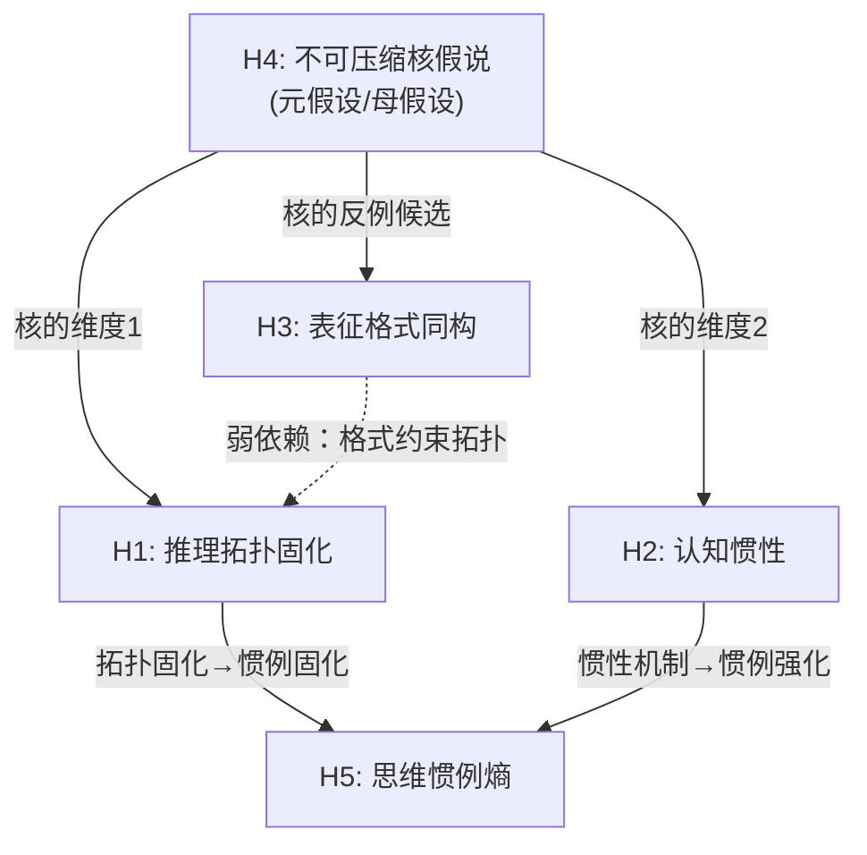

# 五个假设的深度推敲：形式化、攻击与存活分析

> **目标**：对 [insight_cognitive_architecture.md](insight_cognitive_architecture.md) 中的五个假设进行钢铁侠式理论推敲。不是找弱稻草人反驳，而是构造**最强的反对论证**，然后看假设能否存活。

---

## 一、假设间的逻辑依赖关系

先理清五个假设之间的逻辑结构——哪些是独立的，哪些相互依赖：

> [!IMPORTANT]
> **关键结构发现**：H4是母假设（meta-hypothesis），H1和H2是其子假设（构成核的两个维度），H5是H1和H2的下游推论，H3是**独立假设且可能是H4的反例**（如果格式摩擦也属于不可压缩核，则H4需要扩展；如果不属于，则H3验证了核的边界）。
> 
> 这意味着：**H4的成败决定整个框架的成败**。必须最优先对H4做形式化和攻击。

---

## 二、H4（不可压缩核）的数学形式化

### 2.1 问题的精确陈述

设：
- $\mathcal{D}$ = 后训练数据集（其结构特征为 $\mathbf{s}(\mathcal{D})$）
- $\theta_n$ = 在基座模型参数量为 $n$ 的条件下，经 $\mathcal{D}$ 后训练的模型
- $\mathbf{b}(\theta_n)$ = 模型 $\theta_n$ 的行为特征向量（包含所有可观测的认知风格指标）

**不可压缩核的存在性声明**：

$$\exists\; \mathbf{b}_{\text{kernel}} \subset \mathbf{b} \quad \text{s.t.} \quad \forall\; n_1, n_2 > n_{\text{threshold}}: \quad \|\mathbf{b}_{\text{kernel}}(\theta_{n_1}) - \mathbf{b}_{\text{kernel}}(\theta_{n_2})\| < \varepsilon$$

其中 $\varepsilon$ 是一个小常数，$n_{\text{threshold}}$ 是足够大的模型规模（保证基座能力不是瓶颈）。

而对于"表层"特征 $\mathbf{b}_{\text{surface}} = \mathbf{b} \setminus \mathbf{b}_{\text{kernel}}$：

$$\|\mathbf{b}_{\text{surface}}(\theta_{n_1}) - \mathbf{b}_{\text{surface}}(\theta_{n_2})\| \gg \varepsilon \quad \text{when } n_1 \ll n_2$$

### 2.2 信息瓶颈视角的形式化

借用 Tishby et al. (1999) 的信息瓶颈（Information Bottleneck）框架：

后训练可以视为模型 $\theta$ 从数据 $\mathcal{D}$ 中学习一个**压缩表征** $T$，使得：

$$\min_{p(T|\mathcal{D})} \; I(T; \mathcal{D}) - \beta \cdot I(T; \mathcal{B})$$

其中 $I(T; \mathcal{D})$ 是压缩程度（模型保留了多少数据信息），$I(T; \mathcal{B})$ 是相关性（保留的信息对行为的预测力），$\beta$ 是拉格朗日乘子。

**不可压缩核的信息瓶颈解释**：

当 $\beta \to \infty$（即模型极度重视行为预测力），最优压缩 $T^*$ 仍然必须保留的数据信息就是**不可压缩核**：

$$I_{\text{kernel}} = \lim_{\beta \to \infty} I(T^*; \mathcal{D})$$

这个极限存在且大于零，当且仅当**数据中存在某些结构特征是任何模型都无法绕过的必要条件**。

### 2.3 率失真理论的视角

更精确地，可以用率失真理论（Rate-Distortion Theory）：

定义"认知风格失真"：

$$D(\mathcal{D}, \theta_n) = \mathbb{E}_{x \sim \text{tasks}} \left[ d\big(\mathbf{b}_{\text{ideal}}(x, \mathcal{D}), \; \mathbf{b}_{\text{actual}}(x, \theta_n)\big) \right]$$

其中 $\mathbf{b}_{\text{ideal}}(x, \mathcal{D})$ 是数据制度 $\mathcal{D}$ 所"规定"的理想认知风格。

**率失真函数**：

$$R(D) = \min_{p(\theta|\mathcal{D}): \; \mathbb{E}[d] \leq D} I(\mathcal{D}; \theta)$$

不可压缩核对应 $R(0)$——将失真降为零所需的最小信息率。如果 $R(0) > 0$，则核存在；如果 $R(0) = 0$，则任何认知风格都可以被足够大的模型从任何数据中学到——核不存在。

> [!WARNING]
> **形式化的根本困难**：$R(0)$ 的计算需要知道数据和行为的联合分布 $p(\mathcal{D}, \mathcal{B})$，这在实践中不可获得。因此形式化在理论上是严格的，但无法直接计算。需要转向**操作化代理**。

### 2.4 操作化代理：跨规模不变量检测

放弃直接计算 $R(0)$，转向**经验检测**：

**操作化定义**：特征 $b_i$ 属于不可压缩核，当且仅当：

$$\text{CV}_{\text{cross-scale}}(b_i) = \frac{\sigma_{n}(b_i)}{\mu_{n}(b_i)} < \tau$$

其中 $\sigma_n$ 和 $\mu_n$ 是在同一数据制度、不同模型规模 $n$ 下 $b_i$ 的标准差和均值，$\tau$ 是预设阈值（如 0.1）。

**与此同时**，对于表层特征 $b_j$：

$$\text{CV}_{\text{cross-scale}}(b_j) > \tau$$

### 2.5 H4的必要前提：何时核不存在？

H4的逻辑前提是"数据结构中存在模型规模无法替代的信息"。这个前提何时不成立？

**核不存在的充分条件**：

> 如果基座预训练数据已经包含了足够丰富的推理模式（链式/树式/图式/环式全部涵盖），且模型足够大以至于能在推理时动态选择最优拓扑，那么后训练数据的拓扑偏好就不再是"不可压缩"的——它只是一个可以被基座能力覆盖的"偏好提示"。

这意味着：**H4的成立条件是后训练数据引入了预训练数据中不存在（或极稀缺）的结构模式**。

> [!TIP]
> 这实际上是一个可验证的经验问题：预训练语料（如 Common Crawl、Wikipedia、arXiv）中是否包含系统性的"批判→推翻→重建"序列？直觉上，学术论文中有，但密度远低于CAI数据中的制度化密度。因此核的存在是一个**程度问题**，不是二元存在/不存在。

---

## 三、对每个假设的最强攻击

### 3.1 对 H1（推理拓扑固化）的攻击

**最强反驳：拓扑是涌现属性，不是数据属性**

> "推理拓扑不是训练数据的结构特征，而是模型在推理时根据问题复杂度**动态涌现**的属性。同一个模型面对简单问题会产生链式CoT，面对复杂问题会产生树式/图式CoT。因此拓扑分布反映的是**任务分布**而非**数据制度**。你的数据集间拓扑差异可能只是任务难度和领域差异的混淆。"

**存活分析**：

这个攻击是**合理的且必须正面回应**的。防御路径：

1. **控制变量**：在相同任务（同一数学题）上比较不同数据集训练的模型的CoT拓扑。如果拓扑差异在控制任务后仍然存在，则H1存活
2. **弱化声明**：将H1从"拓扑由数据决定"弱化为"数据制度设定了拓扑的**默认偏好分布**，模型在复杂度允许时可以偏离，但默认分布是稳定的"
3. **经验反驳**：RESEARCH_REPORT已经观察到Gemini在所有难度级别（包括简单问题）都套用"AXIOMATIC DECONSTRUCTION"模板——这正是拓扑固化而非动态涌现的证据

**H1的存活概率**：⚠️ **中等**——需要控制任务变量后重新检验。弱化版本大概率存活。

---

### 3.2 对 H2（认知惯性）的攻击

**最强反驳：自回归架构的结构性限制，与训练数据无关**

> "认知惯性是**所有自回归模型的固有属性**——早期token通过注意力机制必然对后续生成施加影响。这不是训练数据的产物，而是架构的必然结果。因此惯性强度的差异可能反映的是**模型架构/规模/注意力机制**的差异，而非数据结构差异。"

**存活分析**：

这个攻击击中了H2的要害。但可以这样防御：

1. **承认架构基线**：所有自回归模型确实有基线惯性。H2的声明应精确化为"数据制度**调制了**惯性的强度，叠加在架构基线之上"
2. **关键证据**：同一架构（如Qwen3.5-9B基座）经不同数据后训练后，惯性指数若存在显著差异，则证明数据确实调制了惯性。这正是THESIS_PROPOSAL中早期ΔW实验的逻辑——相同基座、不同Source、参数指纹不同
3. **类比论证**：人类也有"锚定效应"的认知基线（架构属性），但不同教育背景和训练会显著改变锚定效应的强度（数据调制）。我们不会因此说教育无关紧要

**H2的存活概率**：✅ **高**——只要精确化为"数据调制惯性"而非"数据决定惯性"。

---

### 3.3 对 H3（表征格式同构）的攻击

**最强反驳：格式是tokenizer的产物，不是认知风格**

> "模型使用什么表征格式（公式/代码/自然语言）主要取决于**tokenizer的token效率**和**预训练语料中该格式的频率**，而非后训练数据制度。一个在大量LaTeX语料上预训练的模型天然偏好数学公式，这与'认知风格'无关。"

**存活分析**：

这个攻击**非常有力**，因为它指出格式偏好可能完全来自预训练阶段：

1. **承认预训练的主导作用**：格式偏好确实主要由预训练决定。H3应弱化为"后训练数据**进一步固化或修正**了预训练阶段形成的格式偏好"
2. **关键区分**：H3的真正贡献不在格式偏好本身，而在**格式切换时的信息损失**。即使两个模型都偏好自然语言，它们在被迫切换到数学公式时的**降级程度**可能不同——这个降级才是后训练塑造的
3. **但**：在当前数据集（纯文本CoT）上，格式切换的观察是非常有限的。大部分CoT都是自然语言+少量公式

**H3的存活概率**：⚠️ **低到中等**——作为独立假设较弱，但作为H4的边界检验工具有价值。建议降级为辅助维度。

---

### 3.4 对 H4（不可压缩核）的攻击

**最强反驳：规模足够大时一切皆可涌现（Scaling Law反驳）**

> "Scaling Laws研究（Kaplan et al., 2020; Hoffmann et al., 2022）表明，随着模型规模增大，几乎所有能力都会涌现或改善。你所谓的'不可压缩核'可能只是在当前规模（7B-70B）下的**暂态现象**。当模型规模达到万亿参数时，基座预训练可能已经包含了足够的'推翻-重建'模式，使得后训练数据的拓扑结构不再关键。"

**存活分析**：

这是对H4最致命的攻击。但有几个防御层：

**防御层1：区分"能力"与"偏好"**

> Scaling Laws描述的是**能力上限**（模型能做什么），而认知人格描述的是**默认偏好**（模型倾向于做什么）。一个万亿参数模型可能**有能力**做各种拓扑的推理，但它的**默认偏好**仍然由后训练数据决定。
>
> 类比：一个受过全面教育的人有能力做分析性思维和创造性思维，但ta的**默认思维模式**仍然受早期训练/教育环境的影响。Scaling不消除偏好，只扩展能力边界。

**防御层2：信息论论证**

> 即使基座预训练数据中包含"推翻-重建"模式，其**密度**远低于CAI后训练数据中的密度。在信息论中，低密度信号需要更多参数来提取，但**永远无法达到高密度信号训练出的精确度**——这是率失真理论的基本结论。因此核的大小可能随规模缩小，但不会趋向零。

**防御层3：经验论证**

> GPT-5.5/o3的参数量远大于Claude Opus 4.6，但用户报告（Reddit、知乎）一致认为Claude在"原则性"和"自我修正质量"上优于GPT。如果规模能替代数据结构，GPT应该在所有维度上碾压Claude。实际上的差异正是"核"存在的经验证据。

**防御层4：精确化声明**

> 将H4从"核是绝对不可压缩的"修改为"核的压缩速率极低——需要指数级的规模增长才能线性缩小核的大小"。形式化为：
>
> $$|\mathbf{b}_{\text{kernel}}(n)| \propto \frac{C}{\log n}$$
>
> 其中 $C$ 取决于预训练数据中相关模式的密度。这意味着核在理论上可以趋向零，但需要天文数字级别的规模。

**H4的存活概率**：✅ **高（弱化版本）**——绝对不可压缩可能过强，但"极难压缩"版本几乎确定成立。

---

### 3.5 对 H5（思维惯例熵）的攻击

**最强反驳：推理动作的分类本身就是主观的**

> "你定义了11种'推理动作'（DECOMPOSE, VERIFY, CRITIQUE等），但这个分类体系是你主观设计的。不同的分类会产生不同的熵值。更根本地，一个段落同时包含多种动作（边计算边验证），你的'编码'过程引入了严重的标注偏差。这不是在测量客观的认知属性，而是在测量你自己的分类偏好。"

**存活分析**：

这个攻击击中了H5的方法论核心：

1. **承认分类的主观性**：推理动作字母表确实需要经验验证。防御：使用多个独立标注者计算Cohen's Kappa，证明分类的**跨标注者一致性**
2. **替代方案**：放弃手动分类，改用**无监督方法**——对CoT段落做embedding，用clustering自动发现"推理动作类型"，然后计算cluster序列的熵。这消除了分类主观性
3. **根本性回应**：即使分类有主观性，只要在**所有数据集上使用完全相同的分类标准**，跨数据集的**相对差异**仍然是有信息量的

**H5的存活概率**：⚠️ **中等**——方法论需要加固（无监督聚类替代手动分类），但核心洞察（推理动作序列的可预测性反映认知灵活性）是成立的。

---

## 四、攻击后的假设存活矩阵

| 假设 | 最强攻击 | 存活概率 | 需要的修改 | 在论文中的定位 |
|------|---------|---------|-----------|-------------|
| **H1** | 拓扑是涌现属性非数据属性 | ⚠️ 中 | 弱化为"默认偏好分布"，控制任务变量 | **核心假设之一**，但需经验验证 |
| **H2** | 惯性是架构属性非数据属性 | ✅ 高 | 精确化为"数据调制惯性" | **最强假设**，最具可证伪性 |
| **H3** | 格式偏好来自预训练和tokenizer | ⚠️ 低-中 | 降级为辅助维度 | **边界检验工具**，非核心假设 |
| **H4** | Scaling Law可能消除核 | ✅ 高(弱化版) | 从"绝对不可压缩"改为"极难压缩" | **元假设/框架基石** |
| **H5** | 推理动作分类主观性 | ⚠️ 中 | 引入无监督聚类替代手动分类 | **下游推论**，依赖H1/H2 |

---

## 五、假设体系的精简重构

攻击后，建议将五个假设**精简为三层结构**：

### 第一层：元假设（Framework Hypothesis）

> **H4'（极难压缩核假说）**：后训练数据结构中存在一组认知风格特征，其跨规模压缩速率极低（$\propto 1/\log n$），在当前可达的模型规模范围内表现为实质性不变。这组特征构成LLM认知人格的"准不可压缩核"。

### 第二层：核心假设（Kernel Dimensions）

> **H2'（认知惯性假说）**：核的第一维度——训练数据中"推翻-重建"序列的密度决定了模型的认知惯性强度。惯性强度在同一数据制度的不同规模模型间保持准不变。
>
> **操作化**：早期断言率（EAR）× 推翻事件密度（OED）的乘积

> **H1'（拓扑偏好假说，弱化版）**：核的第二维度——训练数据中推理路径的DAG拓扑类型分布设定了模型的"默认推理形状"。在不控制任务的情况下，这个默认偏好在同一数据制度的不同规模模型间保持准不变。
>
> **操作化**：回溯引用网络密度 + 分支合并比

### 第三层：下游推论（Derived Predictions）

> **H5'（惯例固化推论）**：如果H1'和H2'成立，那么模型的推理动作序列熵也应具有跨规模准不变性——因为惯例是拓扑偏好和认知惯性的**下游表现**。

> **H3'（格式摩擦推论，辅助）**：表征格式切换摩擦**不属于核**，因此应随模型规模增大而减小。这可作为核的**反面验证**——如果格式摩擦也跨规模不变，则核的范围需要扩展。

---

## 六、最深层的理论问题：核与基座的纠缠

以上所有讨论都隐含一个**未解决的根本性问题**：

> **后训练数据的"核"是否独立于基座模型的预训练知识？**

三种可能：

### 场景A：核完全独立于基座

> 后训练数据的拓扑结构和惯性特征完全由数据自身决定，与基座无关。
> 
> **推论**：同一后训练数据在不同基座（Llama、Qwen、Mistral）上应产生相同的核特征。
> 
> **可检验性**：极高。找同一蒸馏数据在不同基座上的微调版本，比较核维度。

### 场景B：核与基座交互

> 后训练数据的核特征部分取决于基座的预训练知识分布。例如，一个在大量数学语料上预训练的基座可能更容易从后训练数据中提取"环式拓扑"模式。
>
> **推论**：核的大小和内容是数据-基座的**联合函数**，不能仅从数据侧分析。
>
> **影响**：这会严重限制论文的声明力度——不能说"数据结构**决定**认知人格"，只能说"数据结构是认知人格的**必要非充分条件**"。

### 场景C：核主要来自基座，后训练只是微调

> 核特征（如拓扑偏好）已在预训练中形成，后训练只是做了边际调整。
>
> **推论**：论文的核心命题（"认知人格由后训练数据结构决定"）被根本性否证。
>
> **证据检验**：如果未经后训练的基座模型在核维度上已经表现出强烈的固定偏好，则场景C成立。

> [!CAUTION]
> **场景B最可能成立**。这意味着论文的声明需要从"数据结构决定认知人格"精确化为"数据结构是认知人格的**制度化载体和调制器**"。基座提供能力基线，后训练数据在基线之上**锁定**特定的认知风格。
>
> 这实际上**不削弱**论文的价值——因为即使核与基座交互，后训练数据仍然是**可控、可设计、可测量**的变量，而基座在训练后是固定的。论文的实践意义在于："给定一个固定的基座，如何通过后训练数据设计来塑造期望的认知风格？"

---

## 七、CAI/W4S与不可压缩核的深度连接

### 7.1 CAI的核注入机制

将CAI数据的结构用核的语言重新描述：

| CAI数据组件 | 注入的核维度 | 信息论机制 |
|-----------|-----------|----------|
| 批判-修正序列 | **降低认知惯性** | 增加训练分布中"推翻"事件的频率 → 降低 $p(\text{confirm} \| \text{initial hypothesis})$ |
| 原则-违反-判断三元组 | **注入环式拓扑** | 创建"规则→违反检测→判断→新规则"的循环依赖结构 |
| 不可协商规则标注 | **锁定不确定性时序** | 将不确定性表达从"结论后免责"推前到"推理前边界声明" |
| 多轮自我批判迭代 | **复合效应** | 同时降低惯性+注入环式拓扑+前移不确定性 |

**关键推论**：CAI之所以有效，不是因为它教了模型"什么是对的"（内容），而是因为它在训练数据中**制度化地植入了核维度的期望值**（结构）。

> 如果我们能证明：去除CAI数据中的具体伦理内容，仅保留"批判→修正"的结构骨架，模型仍然具备高质量的元认知监控能力——那么H4就获得了最强的验证。这也是一个可以用开源数据做的实验。

### 7.2 W4S的核监督机制

W4S框架下"弱监督者如何校准强模型"的信息论解释：

$$I(\text{weak supervisor signal}; \mathbf{b}_{\text{kernel}}) \gg I(\text{weak supervisor signal}; \mathbf{b}_{\text{surface}})$$

翻译：弱监督者（人类）的信号与核维度的互信息远大于与表层维度的互信息。

**为什么？**

因为核维度对应的正是人类最擅长直觉判断的认知属性：
- **认知惯性**（"你太自信了/你没有认真检查"）→ 人类天然能检测过度自信
- **拓扑质量**（"你的论证跳步了/你没有考虑反例"）→ 人类天然能检测逻辑漏洞
- **不确定性时序**（"你应该一开始就说不确定"）→ 人类天然反感事后甩锅

而表层维度（格式一致性、触发词密度、社交润滑度）人类**无法有效监督**——因为它们需要大规模统计才能检测。

> **W4S的深层含义**：弱者之所以能校准强者，是因为**核维度恰好是人类认知系统经过进化优化的检测目标**。人类几十万年来都在检测同类的"过度自信"和"论证漏洞"——这是社会生存的基本需求。CAI将这种进化适应性制度化为训练数据结构。

---

## 八、最终的理论风险评估

| 理论风险 | 严重性 | 缓解策略 | 对论文的影响 |
|---------|--------|---------|-----------|
| Scaling Law否证核的存在 | ⚠️ 高 | 弱化为"准不可压缩"，给出对数衰减的形式化 | 需修改措辞，不影响核心框架 |
| 基座-数据纠缠使因果推断困难 | ⚠️ 高 | 声明核是数据-基座联合函数，论文聚焦"数据作为可控变量" | 需增加"限制条件"讨论 |
| 拓扑分类的任务混淆 | ⚠️ 中 | 控制任务类型做亚组分析 | 需要额外实验设计 |
| 推理动作编码的主观性 | ⚠️ 中 | 引入无监督聚类和多标注者Kappa | 方法论章节需加强 |
| 缺乏隐式CoT对照组 | ❌ 低-中 | 已在RESEARCH_REPORT中明确标注为限制 | 不影响核心假设（核假说不依赖显隐对比） |

---

## 九、建议的理论优先级调整

基于以上推敲，对论文的理论框架建议如下优先级：

| 层级 | 内容 | 在论文中的位置 | 成熟度 |
|------|------|-------------|--------|
| **核心理论** | H4'（准不可压缩核）+ H2'（认知惯性）+ H1'（拓扑偏好） | 第三章理论框架 | 🟢 可写入 |
| **方法论创新** | 推理拓扑DAG检测 + 惯性指数计算 + 推理动作序列熵 | 第三-四章 | 🟡 需pilot验证 |
| **辅助验证** | H3'（格式摩擦作为核的反面检验）+ H5'（惯例熵作为下游推论） | 第四章讨论部分 | 🟡 降级为辅助 |
| **哲学扩展** | CAI的核注入机制 + W4S的核监督机制 | 第五-六章讨论 | 🟢 可写入（理论层） |
| **需要放弃** | VAS价值锚定（数据不支持）、绝对不可压缩声明 | 降级为附录/未来工作 | 🔴 放弃主线 |
