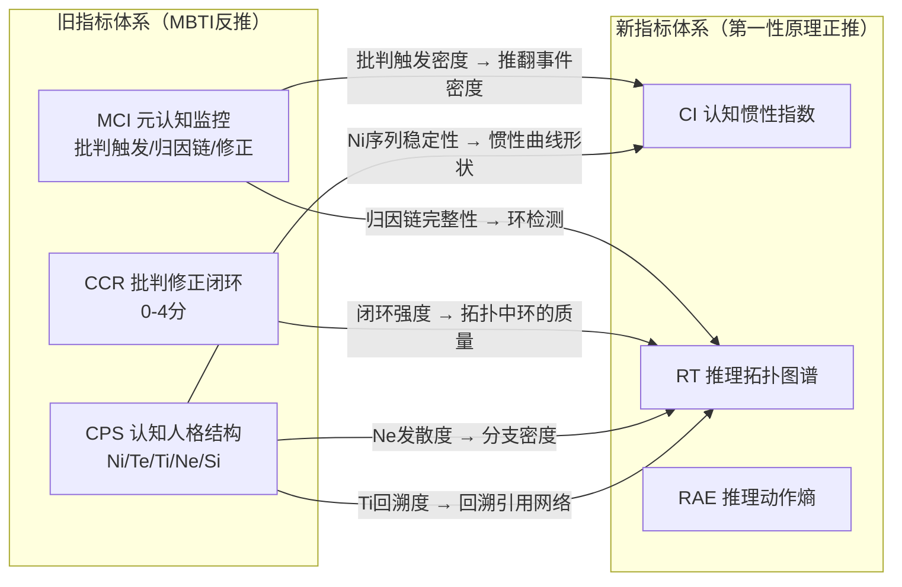

# 存活假设的操作化协议：从理论到可计算指标

> **前置文档**：
> - [insight_cognitive_architecture.md](insight_cognitive_architecture.md) — 五个原始假设
> - [hypothesis_scrutiny.md](hypothesis_scrutiny.md) — 攻击后的存活分析与精简

> **目标**：将推敲后存活的三层假设转化为**可在现有数据集上直接计算**的指标协议。每个指标必须满足：（1）从纯文本特征可计算；（2）有明确的预期基线值；（3）与现有指标体系（CPS/MCI/CCR）有清晰的映射关系。

---

## 一、指标体系总览：新旧映射

### 旧体系 → 新体系的继承关系



> [!IMPORTANT]
> **核心区别**：旧指标是**平面化的密度统计**（每1000 tokens多少个X），新指标是**结构化的拓扑/序列统计**（X之间的依赖关系是什么）。新指标不替代旧指标，而是在旧指标之上增加**结构维度**。

---

## 二、指标1：认知惯性指数（Cognitive Inertia Index, CI）

### 对应假设：H2'（认知惯性假说）
### 核心问题：模型的初始假设对最终结论的"引力"有多强？

### 2.1 子指标A：早期断言率（Early Assertion Rate, EAR）

**定义**：CoT前20%文本中包含**结论性断言**的段落占比。

**结论性断言的正则模式**（中英双语）：

```python
ASSERTION_PATTERNS = [
    # 英文
    r"(?i)\b(the answer is|therefore|thus|clearly|obviously|it follows that)\b",
    r"(?i)\b(we can conclude|this means|this implies|the result is)\b",
    r"(?i)\b(without doubt|certainly|definitely|undoubtedly)\b",
    # 中文
    r"(答案[是为]|因此|所以|显然|很明显|可以得出|结论[是为])",
    r"(毫无疑问|确定[地是]|必然[是地]|不难看出)",
]
```

**计算方法**：

```python
def compute_EAR(cot_text: str) -> float:
    """早期断言率：CoT前20%中的断言密度"""
    paragraphs = split_into_paragraphs(cot_text)
    n_total = len(paragraphs)
    if n_total < 5:
        return float('nan')  # 段落太少，不可靠
    
    early_cutoff = max(1, int(n_total * 0.2))
    early_paragraphs = paragraphs[:early_cutoff]
    
    assertion_count = 0
    for para in early_paragraphs:
        if any(re.search(p, para) for p in ASSERTION_PATTERNS):
            assertion_count += 1
    
    return assertion_count / len(early_paragraphs)
```

**预期基线**：

| 数据集 | 预期EAR | 理由 |
|--------|---------|------|
| Claude (nohurry filtered) | 0.10 - 0.20 | CAI数据训练出谨慎的开局风格 |
| Gemini (Roman hard) | 0.30 - 0.50 | 模板化开局（"AXIOMATIC DECONSTRUCTION"）倾向于早期给出框架性断言 |
| 蒸馏模型基线 | 0.40 - 0.60 | SFT直接学最终答案，推理链"结论先行" |

---

### 2.2 子指标B：推翻事件密度（Overthrow Event Density, OED）

**定义**：CoT中"推翻已建立中间结论"的事件数，归一化到每1000 tokens。

**推翻事件的识别模式**（关键：不是简单的批判词，而是**先有结论再被推翻**的序列）：

```python
OVERTHROW_PATTERNS = [
    # 英文：先前结论 + 推翻标记
    r"(?i)(earlier|previously|above|before).{0,100}(wrong|incorrect|mistake|flawed)",
    r"(?i)(I (said|stated|concluded|assumed)).{0,80}(but|however|actually).{0,80}(incorrect|wrong|not right)",
    r"(?i)(wait|hold on|actually).{0,50}(this (is|was) wrong|let me reconsider|I need to rethink)",
    r"(?i)(my (initial|previous|earlier) (assumption|conclusion|approach)).{0,50}(was wrong|is incorrect|doesn't hold)",
    # 中文：
    r"(之前|前面|上面|刚才).{0,50}(错了|不对|有误|不成立|有问题)",
    r"(等等|不对|且慢).{0,30}(之前|前面|刚才).{0,30}(不对|错了|需要重新)",
    r"(我(之前|刚才|前面)(的|所)(假设|结论|推导|判断)).{0,30}(有误|错了|不对|需要修正)",
]
```

**与旧指标的区别**：

| | 旧指标（批判触发词密度） | 新指标（OED） |
|---|---|---|
| 检测对象 | 孤立的触发词（wait/but/however） | **序列**：先有结论→再有推翻 |
| 假阳性 | 高（行文转折也会命中） | 低（要求前文存在可识别的中间结论） |
| 信息量 | 低（只说"出现了批判"） | 高（说"一个已建立的结论被推翻了"） |

**计算方法**：

```python
def compute_OED(cot_text: str) -> float:
    """推翻事件密度：每1000 tokens的推翻事件数"""
    tokens = tokenize(cot_text)
    n_tokens = len(tokens)
    if n_tokens < 100:
        return float('nan')
    
    overthrow_count = 0
    for pattern in OVERTHROW_PATTERNS:
        overthrow_count += len(re.findall(pattern, cot_text))
    
    return overthrow_count / n_tokens * 1000
```

**预期基线**：

| 数据集 | 预期OED | 理由 |
|--------|---------|------|
| Claude (nohurry filtered) | 1.5 - 3.0 | CAI制度化的修正序列，但频率适中 |
| Claude (Roman 10000x) | 0.5 - 1.5 | 未过滤，含大量简单题无需推翻 |
| Gemini (Roman hard) | 0.3 - 1.0 | 高格式漂移但缺乏真正的推翻 |

---

### 2.3 子指标C：惯性曲线（Inertia Curve）

**定义**：将CoT按位置分为10个等分区间（decile），计算每个区间中"新信息引入率"。

**新信息引入**的proxy：在该区间中**首次出现**的实体/概念的数量（通过名词短语提取近似）。

**惯性曲线的形状分类**：

```
高惯性（J型）：          低惯性（P型）：           病理惯性（漂移型）：
                         
新  |████                新  |██                   新  |██
信  |███                 信  |████                 信  |█
息  |██                  息  |████                 息  |████
引  |█                   息  |███                  息  |███████
入  |█                   引  |██                   引  |████
率  |█                   入  |████                 入  |████████
    |_________           率  |_________              |_________
    0%      100%             0%      100%             0%      100%
    
    早期锁定，后期            全程均匀引入             后期反而引入更多新
    只是执行                  新概念                   概念——目标漂移
```

**计算方法**：

```python
def compute_inertia_curve(cot_text: str, n_bins: int = 10) -> list[float]:
    """计算惯性曲线：每个位置区间的新概念引入率"""
    paragraphs = split_into_paragraphs(cot_text)
    n = len(paragraphs)
    if n < n_bins:
        return [float('nan')] * n_bins
    
    bin_size = n // n_bins
    seen_concepts = set()
    curve = []
    
    for i in range(n_bins):
        start = i * bin_size
        end = start + bin_size if i < n_bins - 1 else n
        bin_text = " ".join(paragraphs[start:end])
        
        # 提取名词短语作为概念proxy
        concepts = extract_noun_phrases(bin_text)
        new_concepts = concepts - seen_concepts
        seen_concepts.update(concepts)
        
        # 新概念引入率 = 新概念数 / 该区间总概念数
        rate = len(new_concepts) / max(len(concepts), 1)
        curve.append(rate)
    
    return curve

def classify_inertia_type(curve: list[float]) -> str:
    """根据曲线形状分类惯性类型"""
    if len(curve) < 3:
        return "unknown"
    
    early = sum(curve[:3]) / 3
    mid = sum(curve[3:7]) / 4
    late = sum(curve[7:]) / 3
    
    if early > mid > late:
        return "J-type"  # 递减：早期锁定
    elif abs(early - mid) < 0.1 and abs(mid - late) < 0.1:
        return "P-type"  # 均匀：持续开放
    elif late > early:
        return "drift-type"  # 递增：目标漂移
    else:
        return "mixed"
```

### 2.4 综合认知惯性指数

$$\text{CI} = \frac{\text{EAR}}{\text{OED} + \varepsilon} \times \text{Slope}(\text{inertia\_curve})$$

其中：
- $\text{EAR}$ 高 + $\text{OED}$ 低 = 高惯性（早期断言且不推翻）
- $\text{EAR}$ 低 + $\text{OED}$ 高 = 低惯性（谨慎开局且频繁推翻）
- $\text{Slope}$ 是惯性曲线的线性回归斜率（负斜率=递减=J型惯性）
- $\varepsilon = 0.01$ 避免除零

---

## 三、指标2：推理拓扑图谱（Reasoning Topology Graph, RT）

### 对应假设：H1'（拓扑偏好假说，弱化版）
### 核心问题：推理步骤之间的依赖关系是什么形状？

### 3.1 段落依赖图的构建

**核心操作**：将每个CoT转化为一个**段落级有向无环图（DAG）**。

**依赖关系的检测方法**：

```python
DEPENDENCY_PATTERNS = {
    "explicit_back_reference": [
        # 英文
        r"(?i)(as (mentioned|shown|noted|discussed|established) (above|earlier|before|previously|in step \d))",
        r"(?i)(from (step|phase|part|equation) \d)",
        r"(?i)(recall(ing)? that|returning to|going back to|building on)",
        r"(?i)(using the (result|fact|equation|value) from)",
        # 中文
        r"(如前[所面]述|根据(前面|上面|之前|第\d[步阶]))",
        r"(回[到顾]|回溯|利用(之前|前面|上述)的(结[论果]|公式|等式))",
    ],
    "implicit_value_reference": [
        # 直接引用前文计算出的具体数值
        # 需要动态检测：如果段落P_j中出现了段落P_i中首次计算的数值，
        # 则P_i → P_j
    ],
    "causal_connector": [
        r"(?i)(therefore|hence|thus|consequently|as a result)",
        r"(?i)(this (means|implies|leads to|gives us))",
        r"(因此|所以|由此[可得]|这[意说]明)",
    ],
    "branch_marker": [
        r"(?i)(alternatively|on the other hand|another (approach|way|method))",
        r"(?i)(case [12]|scenario [AB]|if .{0,30} then .{0,30} else)",
        r"(另一[方种]面|或者|如果.{0,20}则.{0,20}否则)",
    ],
    "merge_marker": [
        r"(?i)(combining|integrating|taking (both|all) .{0,30} into account)",
        r"(?i)(in (summary|conclusion)|putting it all together|overall)",
        r"(综合[以上]|综上所述|总[结的]来[看说]|结合(上述|以上|两[者种]))",
    ],
}
```

**DAG构建伪代码**：

```python
def build_reasoning_dag(cot_text: str) -> nx.DiGraph:
    """从CoT文本构建段落级推理依赖图"""
    paragraphs = split_into_paragraphs(cot_text)
    G = nx.DiGraph()
    
    for i, para in enumerate(paragraphs):
        G.add_node(i, text=para[:100])  # 节点=段落
    
    for j, para_j in enumerate(paragraphs):
        # 检测显式回溯引用
        for pattern in DEPENDENCY_PATTERNS["explicit_back_reference"]:
            if re.search(pattern, para_j):
                # 尝试解析引用目标（"step 3" → 段落3）
                target_i = resolve_reference_target(para_j, pattern, paragraphs)
                if target_i is not None and target_i < j:
                    G.add_edge(target_i, j, type="back_reference")
        
        # 检测因果连接（默认连接到前一段落）
        for pattern in DEPENDENCY_PATTERNS["causal_connector"]:
            if re.search(pattern, para_j) and j > 0:
                G.add_edge(j-1, j, type="causal")
        
        # 检测分支标记
        for pattern in DEPENDENCY_PATTERNS["branch_marker"]:
            if re.search(pattern, para_j) and j > 0:
                G.add_edge(j-1, j, type="branch")
        
        # 检测合并标记
        for pattern in DEPENDENCY_PATTERNS["merge_marker"]:
            if re.search(pattern, para_j):
                # 合并通常引用前面多个段落
                for k in range(max(0, j-5), j):
                    if has_content_overlap(paragraphs[k], para_j):
                        G.add_edge(k, j, type="merge")
    
    return G
```

### 3.2 拓扑特征提取

从DAG中提取四个拓扑指标：

```python
def extract_topology_features(G: nx.DiGraph) -> dict:
    n_nodes = G.number_of_nodes()
    n_edges = G.number_of_edges()
    
    if n_nodes < 3:
        return {"density": float('nan'), ...}
    
    features = {}
    
    # 1. 拓扑密度 (Topology Density, TD)
    # 边数/节点数。链式=1.0，图式>1.0，孤立段落<1.0
    features["topology_density"] = n_edges / n_nodes
    
    # 2. 分支合并比 (Branch-Merge Ratio, BMR)
    branch_edges = sum(1 for _, _, d in G.edges(data=True) if d.get("type") == "branch")
    merge_edges = sum(1 for _, _, d in G.edges(data=True) if d.get("type") == "merge")
    features["branch_merge_ratio"] = branch_edges / max(merge_edges, 1)
    # BMR > 1：发散>收敛（Ne型），BMR < 1：收敛>发散（Ni型）
    
    # 3. 回溯深度 (Back-Reference Depth, BRD)
    back_refs = [(u, v) for u, v, d in G.edges(data=True) if d.get("type") == "back_reference"]
    if back_refs:
        depths = [v - u for u, v in back_refs]  # 引用跨越的段落距离
        features["back_reference_depth_mean"] = sum(depths) / len(depths)
        features["back_reference_depth_max"] = max(depths)
    else:
        features["back_reference_depth_mean"] = 0.0
        features["back_reference_depth_max"] = 0
    
    # 4. 环检测（修正闭环）
    # 在DAG中找"推翻-重建"结构：A→B→C→A'，其中A'修正了A的结论
    # 近似：检测是否有从后面段落回到前面段落的"逻辑修正"边
    correction_edges = sum(1 for u, v, d in G.edges(data=True) 
                          if d.get("type") == "back_reference" and v < u)
    # 注意：DAG中不应有真正的环。这里检测的是"修正关系"而非依赖关系
    # 实际实现：检测OVERTHROW_PATTERNS匹配的段落是否引用了前面的段落
    features["correction_loop_count"] = correction_edges
    
    # 5. 拓扑类型分类
    td = features["topology_density"]
    bmr = features["branch_merge_ratio"]
    brd = features["back_reference_depth_mean"]
    loops = features["correction_loop_count"]
    
    if td < 0.8 and brd < 2:
        features["topology_type"] = "chain"  # 线性推理
    elif bmr > 1.5 and merge_edges < 2:
        features["topology_type"] = "tree"   # 分治但不合并
    elif merge_edges >= 2 and td > 1.2:
        features["topology_type"] = "graph"  # 多路径汇聚
    elif loops >= 2:
        features["topology_type"] = "loop"   # 修正闭环
    elif td < 0.5:
        features["topology_type"] = "drift"  # 段落间几乎无依赖
    else:
        features["topology_type"] = "mixed"
    
    return features
```

### 3.3 预期拓扑分布

| 数据集 | 预期主导类型 | TD均值 | BMR均值 | BRD均值 |
|--------|------------|--------|---------|---------|
| Claude (nohurry filtered) | loop + graph | 1.2-1.5 | 0.8-1.0 | 3-5 |
| Claude (Roman 10000x) | chain + mixed | 0.9-1.1 | 0.5-0.8 | 1-3 |
| Gemini (Roman hard) | tree + drift | 0.7-1.0 | 1.5-2.5 | 1-2 |

---

## 四、指标3：推理动作序列熵（Reasoning Action Entropy, RAE）

### 对应假设：H5'（惯例固化推论）
### 核心问题：模型的推理步骤序列有多"可预测"？

### 4.1 无监督推理动作分类（替代手动分类）

根据推敲中对H5的攻击（"手动分类主观性"），采用**半监督方案**：

**步骤1**：定义少量**锚点动作**（高一致性、低歧义）：

```python
ANCHOR_ACTIONS = {
    "VERIFY": [
        r"(?i)(let me (check|verify|confirm|double.check))",
        r"(?i)(to verify|checking|verification|验证|检查[一下])",
    ],
    "CRITIQUE": [
        r"(?i)(wait|hold on|but this|however this|this (is|seems) wrong)",
        r"(等等|不对|但这|然而这|这.{0,5}(有问题|不对|错了))",
    ],
    "CONCLUDE": [
        r"(?i)(therefore|thus|in conclusion|the (answer|result|solution) is)",
        r"(因此|所以|结论[是为]|答案[是为]|综上)",
    ],
    "EXPLORE": [
        r"(?i)(alternatively|another (way|approach|method)|what if|suppose)",
        r"(另一[种方]|或者|假[设如]|如果我们)",
    ],
    "DECOMPOSE": [
        r"(?i)(let me break|step \d|first.{0,10}(we|I) (need|should|will))",
        r"(分[解步]|第[一二三四\d]步|首先.{0,10}(我们|需要))",
    ],
    "CALCULATE": [
        r"(?i)(calculating|computing|evaluating|substituting|plugging in)",
        r"(计算|代入|求解|带入|运算)",
        r"\$.*[=+\-*/].*\$",  # LaTeX公式
    ],
    "OTHER": [],  # 默认类别
}
```

**步骤2**：对每个段落，匹配锚点动作。如果无匹配，标记为`OTHER`：

```python
def classify_paragraph_action(paragraph: str) -> str:
    """将段落分类为推理动作类型"""
    scores = {}
    for action, patterns in ANCHOR_ACTIONS.items():
        if action == "OTHER":
            continue
        score = sum(1 for p in patterns if re.search(p, paragraph))
        if score > 0:
            scores[action] = score
    
    if not scores:
        return "OTHER"
    return max(scores, key=scores.get)
```

**步骤3**：将CoT编码为动作序列并计算bigram熵：

```python
def compute_RAE(cot_text: str) -> dict:
    """计算推理动作序列熵"""
    paragraphs = split_into_paragraphs(cot_text)
    if len(paragraphs) < 5:
        return {"bigram_entropy": float('nan'), "dominant_bigram_ratio": float('nan')}
    
    # 编码
    actions = [classify_paragraph_action(p) for p in paragraphs]
    
    # 过滤连续重复（"CALCULATE CALCULATE CALCULATE" → "CALCULATE"）
    compressed = [actions[0]]
    for a in actions[1:]:
        if a != compressed[-1]:
            compressed.append(a)
    
    # 计算bigram分布
    bigrams = [(compressed[i], compressed[i+1]) for i in range(len(compressed)-1)]
    bigram_counts = Counter(bigrams)
    total = sum(bigram_counts.values())
    
    if total < 3:
        return {"bigram_entropy": float('nan'), "dominant_bigram_ratio": float('nan')}
    
    # Shannon熵
    entropy = -sum((c/total) * math.log2(c/total) for c in bigram_counts.values())
    
    # 主导bigram占比
    top3 = sum(c for _, c in bigram_counts.most_common(3))
    dominant_ratio = top3 / total
    
    # 惯例固化指数 = 1 - 归一化熵
    max_entropy = math.log2(min(total, len(ANCHOR_ACTIONS)**2))
    routinization = 1 - (entropy / max_entropy) if max_entropy > 0 else 1.0
    
    return {
        "bigram_entropy": entropy,
        "dominant_bigram_ratio": dominant_ratio,
        "routinization_index": routinization,
        "top_bigrams": bigram_counts.most_common(5),
        "action_sequence_compressed": compressed,
    }
```

### 4.2 预期基线

| 数据集 | 预期bigram熵 | 预期dominant_ratio | 预期特征性bigram |
|--------|-------------|-------------------|----------------|
| Claude (nohurry) | 2.5 - 3.5 | 0.30 - 0.45 | CRITIQUE→CALCULATE, VERIFY→CONCLUDE |
| Gemini (Roman) | 1.5 - 2.5 | 0.50 - 0.65 | DECOMPOSE→EXPLORE, EXPLORE→EXPLORE |
| 蒸馏通用基线 | 1.0 - 2.0 | 0.55 - 0.75 | CALCULATE→CONCLUDE, DECOMPOSE→CALCULATE |

> [!TIP]
> **关键预测**：如果Gemini的bigram熵**低于**Claude（即Gemini更"可预测"），这将是一个强反直觉发现——因为Gemini**看起来**更发散，但其发散可能是**模板化的伪发散**（DECOMPOSE→EXPLORE→EXPLORE的固定套路）。

---

## 五、三个指标的综合分析框架

### 5.1 认知人格空间的坐标系

三个新指标构成一个三维"认知人格空间"：

```
                    高CI（高惯性/J型）
                         |
                         |
              蒸馏 ●     |     ● GPT(推测)
                         |
         ──────────────── + ──────────────── 高RAE（高固化）
                         |
              Claude ●   |     ● Gemini
                         |
                    低CI（低惯性/P型）
                         
        （第三轴 RT-TD 垂直于纸面）
```

### 5.2 与现有指标的联合分析

**建议的分析策略**：不是用新指标替代旧指标，而是**交叉验证**：

| 验证目标 | 旧指标 | 新指标 | 预期关系 |
|---------|--------|--------|---------|
| "真批判" vs "假批判" | MCI归因链完整性 | CI-OED × RT-correction_loop | 正相关：有推翻+有修正闭环 = 真批判 |
| "真发散" vs "假发散" | CPS-Ne（探索发散度） | RAE-bigram_entropy | **可能负相关**：Ne高但熵低=模板化伪发散 |
| "真结构" vs "假结构" | CPS-Ni（序列稳定性） | RT-topology_density | 正相关：高Ni+高TD = 真正结构化推理 |
| "蒸馏保真度" | DRS-深层结构保留 | CI跨Teacher-Student差异 | 正相关：CI差异大 = 认知人格丢失 |

### 5.3 统计检验方案

```python
# 跨数据集比较
from scipy.stats import kruskal, mannwhitneyu
from cliffs_delta import cliffs_delta

def compare_datasets(datasets: dict[str, list[dict]]) -> dict:
    """跨数据集的指标比较"""
    results = {}
    
    for metric in ["CI", "RT_topology_density", "RAE_bigram_entropy"]:
        values = {name: [s[metric] for s in samples if not math.isnan(s[metric])]
                  for name, samples in datasets.items()}
        
        # Kruskal-Wallis检验（非参数）
        stat, p_value = kruskal(*values.values())
        
        # 效应量（Cliff's delta，成对）
        effect_sizes = {}
        names = list(values.keys())
        for i in range(len(names)):
            for j in range(i+1, len(names)):
                d, _ = cliffs_delta(values[names[i]], values[names[j]])
                effect_sizes[f"{names[i]}_vs_{names[j]}"] = d
        
        results[metric] = {
            "kruskal_stat": stat,
            "p_value": p_value,
            "effect_sizes": effect_sizes,
            "medians": {name: np.median(v) for name, v in values.items()},
            "IQR": {name: (np.percentile(v, 25), np.percentile(v, 75)) 
                    for name, v in values.items()},
        }
    
    return results
```

---

## 六、与核心命题的最终对齐

### 6.1 这些指标如何回答核心命题？

> **核心命题**：大语言模型的"认知人格差异"是否可被其后训练数据结构所预测。

**验证逻辑**：

```
如果：
  1. CI（认知惯性）在不同数据集间存在统计显著差异（p < 0.05, |d| > 0.3）
  2. RT（推理拓扑）的类型分布在不同数据集间存在卡方检验显著差异
  3. RAE（推理动作熵）在不同数据集间存在显著差异
  
且：
  4. 这些差异在控制了文本长度、任务领域后仍然存在

那么：
  核心命题获得支持——数据结构确实预测了认知风格差异。

进一步，如果：
  5. CI、RT、RAE三者之间存在理论预测的相关结构（如H1'和H2'共同预测H5'）

那么：
  不仅获得了统计支持，还获得了**结构性验证**——
  三个独立设计的指标呈现了理论预期的内在一致性。
```

### 6.2 风险控制

| 风险 | 缓解 |
|------|------|
| 三个数据集的领域不匹配 | 按domain/difficulty分层后做亚组分析 |
| 文本长度混淆 | 所有密度指标归一化到每1000 tokens |
| 正则模式的假阳性/假阴性 | 人工抽检200条，计算precision/recall |
| 样本量不足（nohurry仅2.3k） | 使用bootstrap CI，报告统计功效（power） |

---

## 七、Pilot实验执行清单

| 步骤 | 动作 | 输入 | 输出 | 预计耗时 |
|------|------|------|------|---------|
| 1 | 统一三个数据集格式 | HF数据集 | 统一JSON格式 | 0.5天 |
| 2 | 每个数据集随机抽100条 | 统一格式数据 | 300条样本 | 0.5天 |
| 3 | 实现CI计算（EAR + OED） | 300条样本 | CI数值 + 惯性曲线 | 1天 |
| 4 | 实现RT拓扑构建 | 300条样本 | DAG + 拓扑特征 | 1.5天 |
| 5 | 实现RAE动作序列分析 | 300条样本 | 动作序列 + 熵值 | 1天 |
| 6 | 跨数据集统计对比 | CI/RT/RAE数值 | 箱线图 + 效应量 | 0.5天 |
| 7 | 人工抽检50条验证正则精度 | 50条样本 | precision/recall | 1天 |
| **总计** | | | | **~6天** |

> [!NOTE]
> 这6天的pilot产出的核心价值：**一张三维认知人格空间的散点图**——每个数据集在CI×RT-TD×RAE空间中的分布。如果三个数据集在这个空间中占据了不同的区域，论文的核心创新点就成立。
