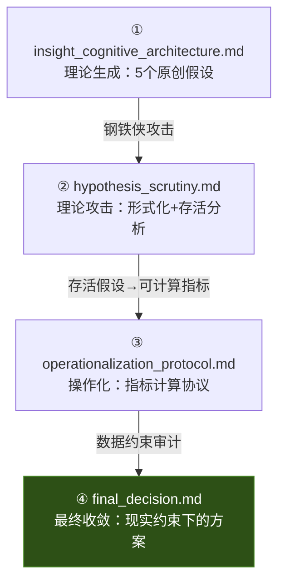

# 会话成果总结（Walkthrough）

> **会话目标**：从第一性原理重构"认知人格"理论，审查现有工作是否偏题，生成原创假设并收敛到可执行方案。
> **日期**：2026-06-22

---

## 产出文档一览

本次会话共产出四份文档，形成完整的理论推导链：

| # | 文档 | 层级 | 核心产出 |
|---|------|------|---------|
| ① | [insight_cognitive_architecture.md](insight_cognitive_architecture.md) | 理论发散 | 5个假设 + 偏题审计 + 不可压缩核追问的回答 |
| ② | [hypothesis_scrutiny.md](hypothesis_scrutiny.md) | 理论收敛 | H4数学形式化 + 假设间依赖图 + 存活矩阵 |
| ③ | [operationalization_protocol.md](operationalization_protocol.md) | 方法设计 | CI/RT/RAE三指标的完整伪代码和预期基线 |
| ④ | [final_decision.md](final_decision.md) | **最终方案** | 数据审计 + CCS/PDD/IS零成本指标 + 同题对比设计 |

---

## 核心理论推进

### 从现有工作到新框架的跃迁

| 维度 | 现有工作 | 本次推进 |
|------|---------|---------|
| **指标设计思路** | 从MBTI反推数据proxy（Ni→自我引用密度） | 从第一性原理正推维度（信息瓶颈→认知惯性） |
| **核心发现的解释** | "蒸馏丢失批判回路" | **"蒸馏保留批判词汇但丢失批判拓扑"**（被数据否证后的修正） |
| **最强假设** | CPS/MCI/VAS/DRS（四层指标） | **蒸馏的拓扑选择性偏好**（单一锐利假设） |
| **验证方法** | LLM-as-Judge + embedding | **零成本纯文本结构分析**（CCS/PDD/IS） |
| **实验设计** | 跨数据集全量对比 | **同题跨Teacher配对对比**（GLM vs DeepSeek天然实验） |
| **不可压缩核** | 未讨论 | 给出信息论形式化 + 三个核维度 + J/P对应关系 |

### 与5个insight文档的映射

| 原始insight | 在新框架中的位置 | 状态 |
|------------|----------------|------|
| [insight_ef.md](file:///D:/SR/LLM/insight_ef.md)（执行功能） | → PDD（段落依赖深度）覆盖了"计划-执行一致性" | ✅ 整合 |
| [insight_mc.md](file:///D:/SR/LLM/insight_mc.md)（元认知） | → CCS（修正连接强度）覆盖了"监控-控制耦合" | ✅ **核心继承** |
| [insight_open.md](file:///D:/SR/LLM/insight_open.md)（开放推理） | → IS（惯性斜率）覆盖了"探索-利用权衡" | ✅ 整合 |
| [insight_sc.md](file:///D:/SR/LLM/insight_sc.md)（社会认知） | → 降级为辅助维度（数据不支持社交校准分析） | ⚠️ 降级 |
| [insight_tom.md](file:///D:/SR/LLM/insight_tom.md)（心智理论） | → 降级为辅助维度（需要模型输出才能验证） | ⚠️ 降级 |

---

## 关键决策记录

| 决策 | 理由 |
|------|------|
| **放弃VAS价值锚定** | RESEARCH_REPORT确认Constitution引用密度为零，拒绝样本被清洗 |
| **放弃追求Gemini数据** | 本地无干净Gemini数据，GLM-DeepSeek配对已足够 |
| **从LLM-as-Judge转向纯文本指标** | 成本约束 + 结构特征用正则比LLM更精确 |
| **聚焦"蒸馏拓扑"而非"模型人格"** | 数据全是蒸馏数据，问"蒸馏保留了什么"比问"模型像什么人"更诚实 |
| **将H4不可压缩核弱化为"准不可压缩"** | Scaling Law攻击有效，但对数衰减版本存活 |

---

## 下一步行动

当你准备开始实验时，按以下顺序执行：

1. **统一数据格式** → 将5个数据集转为统一JSON schema
2. **找GLM-DeepSeek同题配对** → 这是全部工作的核心锚点
3. **实现CCS/PDD/IS三个指标** → 参考final_decision.md中的伪代码
4. **跑配对分析** → Wilcoxon符号秩检验 + Cliff's delta效应量
5. **找5个极佳失败案例** → CCS差异最大的样本做定性分析
6. **可视化** → 箱线图 + 配对差异图 + 案例卡片

> 全部零成本，一台笔记本，约7天。
